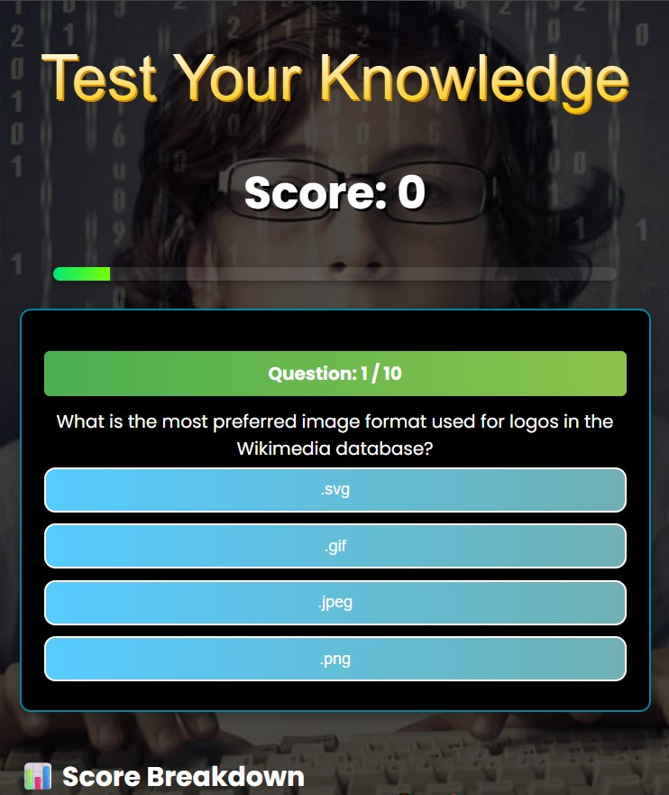
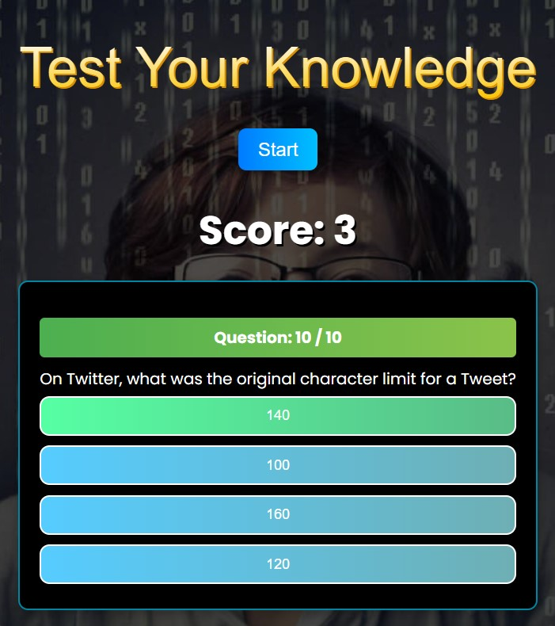
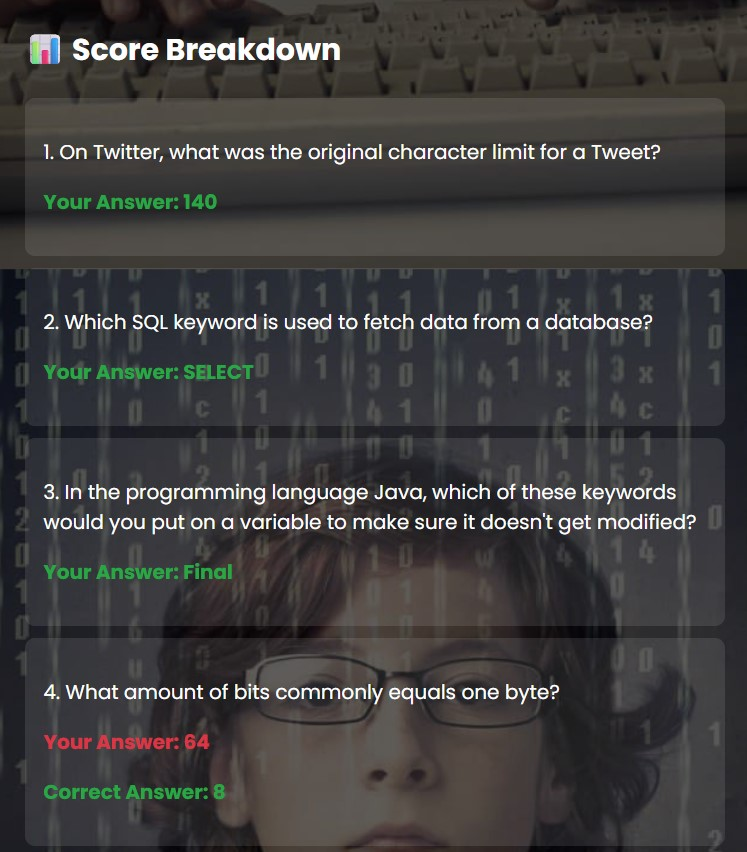

# React Quiz App 🧠⚡

A fully functional quiz application built using **React**, **TypeScript**, and **Styled Components**. The app fetches questions from the [Open Trivia Database](https://opentdb.com/) API and allows users to test their general knowledge in an interactive UI.

---

## 🚀 Features

- ✅ Fetches quiz data from an external API
- 🎯 Multiple choice questions
- 📊 Tracks score in real-time
- 🔁 "Next Question" functionality
- 🔒 Prevents further input after an answer is selected
- 💅 Clean and responsive UI with Styled Components
- 🧪 Built using TypeScript for type safety

---

## 📸 Screenshots

| Feature | Screenshot |
|---------|-----------|
| **HomePage** |  |
| **Start Game** |  |
| **Completed Game** |  |
| **Score Breakdown** |  |

---

## 🛠️ Tech Stack

- **React** (with hooks)
- **TypeScript**
- **Styled Components**
- **Open Trivia DB API**

---

## 📦 Installation

1. **Clone the repository:**
   ```bash
   git clone https://github.com/BinayRajThapa/test_your_knowledge.git

2. **Navigate to the project directory:**
   ```bash
   cd test_your_knowledge

3. **Install the required dependencies:**
   ```bash
   npm install

3. **Run the app:**
   ```bash
   npm start

---

## Contributing 🤝
Contributions are welcome! If you have any suggestions, bug reports, or feature requests, please open an issue or submit a pull request.

---
